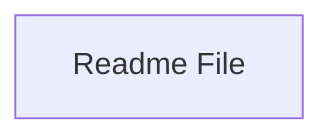

## Stack

Not a code project. Repo root contains only `README.md` (single line: "# redesigned-adventure") and `.git`. No manifest (package.json, go.mod, pyproject.toml, Cargo.toml), no source files, no entry points found.

## Directory map

| path | what lives there |
|---|---|
| `/` | `README.md` (title only), `.git` (version control metadata) |

## Diagram

## Component index

- [[Readme_File]] — the only content in this repository

## Entry points

- Dev entry point: TODO: verify (none exists — no source files present)
- Prod entry point: TODO: verify (none exists — no source files present)

## Conventions

- None observed — repository contains no code to establish conventions.

## Where things go

- To add a project description, edit `README.md`.
- To start actual code, first add a manifest file appropriate to the intended stack (e.g. `package.json`, `pyproject.toml`) — none currently exists.
- No other structure exists to extend at this time.
